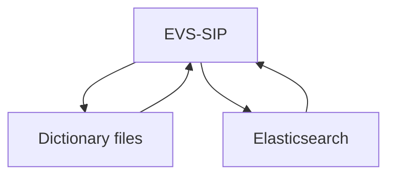

# EVS-SIP

1. [Introduction](#introduction)
2. [Requirements](#requirements)
3. [System overview](#system-overview)
4. [How to set up in a local development environment](#how-to-set-up-in-a-local-development-environment)
   1. [Set up repository](#set-up-repository)
   2. [Environment variables](#environment-variables)
   3. [Run the EVS-SIP backend](#run-the-evs-sip-backend)
   4. [Run Elasticsearch](#run-elasticsearch)
   5. [Build Elasticsearch index](#build-elasticsearch-index)
   6. [Run the EVS-SIP frontend](#run-the-evs-sip-frontend)
   7. [Verifying functionality](#verifying-functionality)
      1. [Search](#search)
      2. [Swagger API](#swagger-api)
      3. [Graphical representation API](#graphical-representation-api)
5. [Project structure](#project-structure)

## Introduction

This repository contains both the frontend and the backend for EVS-SIP.

## Requirements

- Elasticsearch 7.17.10
- Node.js 14.16.0

## System overview

The EVS-SIP web application reads through dictionary files to retrieve data for the public API and graphical API. The web application gets results for the search API from Elasticsearch.



## How to set up in a local development environment

Setup consists of the following steps:

1. Set up repository
2. Configure environment variables
3. Run the EVS-SIP backend
4. Run Elasticsearch
5. Build Elasticsearch index
6. Run the EVS-SIP frontend

### Set up repository

```bash
git clone https://github.com/CBIIT/evs-sip.git
```

Install Node packages:

```bash
npm ci
# or, if necessary:
npm ci --legacy-peer-deps
```

### Environment variables

Modify `.env` to specify the following variables:

- `NODE_ENV` The type of environment. Set this to `dev`.
- `PORT` The port on which the frontend is run. Ensure that this is different from the port used by the backend.
- `LOGDIR` The path in which log files will be stored.
- `EVSSIP_SERV_API_URL` The URL for the search API. For example, `http://localhost:3000/service/search`.
- `REACT_APP_DEV_API_URL` I don't know what this is. For example, `http://localhost:3000/service/search`.
- `EVSSIP_PUB_API_URL`=`http://localhost:3000/api/search`
- `REACT_APP_SERVER`=`http://localhost:3000`

### Run the EVS-SIP backend

Open a shell, and run the command

```bash
npm run backend
```

### Run Elasticsearch

Ensure that Elasticsearch is running on port `9200`.

### Build Elasticsearch index

EVS-SIP's search API uses Elasticsearch. To make Elasticsearch ready for use, you must first build an index. Build the Elasticsearch index by following the steps below:

1. Open a shell, and confirm that an ES service is available by running the command

    ```bash
    curl -X GET http://localhost:9200
    ```

2. Delete the current index by running the command

    ```bash
    curl -X DELETE http://localhost:9200/_all
    ```

3. Build a new index by running the command

    ```bash
    curl http://localhost:3000/service/search/buildIndex
    ```

    You may need to uncomment the following line in `server/service/search/index.js`:

    ```JavaScript
    router.get("/buildIndex", controller.indexing);
    ```

### Run the EVS-SIP frontend

Execute the command

```bash
npm run frontend
```

### Verifying functionality

#### Search

Try searching terms on the homepage or search page. If you see autocomplete suggestions while typing and receive results for your search, then Elasticsearch works.

#### Swagger API

Check out <localhost:3000/api/docs>.

#### Graphical representation API

Check out <localhost:3001/evssip/datamodel> and see if the graphical representation for your selected Data Commons appears.

## Project structure

stub
